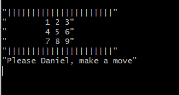
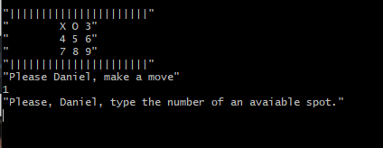
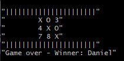

# Tic-Tac-Toe

This repository contains a command prompt implementation of the classic Tic-Tac-Toe game, built with the Ruby language.

Inside the bin/main file, you'll find the Tic Tac Toe Interface class, which handles user interactions; inside lib/logic.rb, you'll find Tic Tac Toe Logic, a class which implements all logic of the game.


## Getting Started

To play the game you need to clone the repository by doing

```bash

git clone https://github.com/phalado/Tic-Tac-Toe

```

Then, go to the project directory by typing:

```bash

cd Tic-Tac-Toe

```

To run the game type:

```bash

bin/main

```

On your command prompt, you'll initialize the game.


## Instructions

- After initializing, you'll be prompted to type two names. Any sequence of characters works. First name corresponds to player 1 and gets first turn -'X'. Player two gets the second name and turn -'O'.
- After typing two names, the board will be presented and player 1 will be prompted to type a valid move.

- If you try an invalid move, you'll be prompted to type it again. Numbers from 1 to 9 are the **only** valid moves.

- The win condition is to line up three of your symbols -'X' for player 1, 'O' for player 2- either vertically, horizontally or diagonally.

- If no player has won and no available spots remain, the game is a tie:


## Testing

Several Rspec tests were also implemented. You can run them -given previous installation of rspec- typing:
```bash
rspec ./spec/spec_helper.rb
```
On the root directory.

### License
This software is registered under the No-License License c:

### Authors

- Raphael Cordeiro	| [Github](https://github.com/phalado/)
- Daniel Chincoya	| [@chincoya7](https://twitter.com/chincoya7)